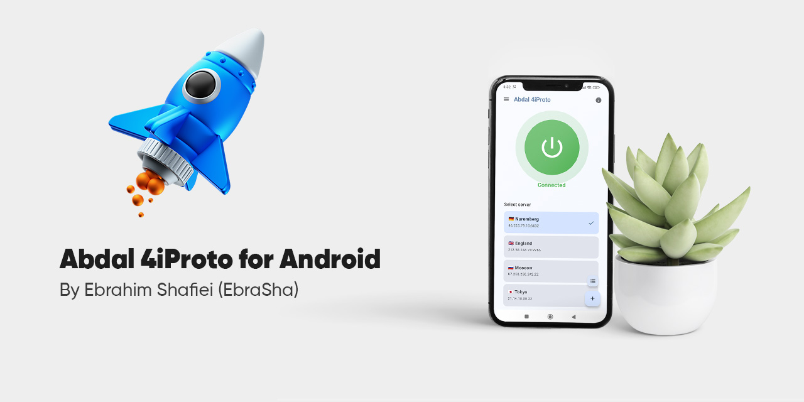

# 🛡️ اندروید Abdal 4iProto

📖 [English](README.md) | **فارسی**

  

**تونل‌سازی امن، سریع و هوشمندِ سراسری مبتنی بر SSH برای اندروید — دروازه‌ی شخصی شما برای دسترسی رمزنگاری‌شده و خصوصی به اینترنت.**

اندروید Abdal 4iProto کلاینت رسمی اندرویدِ اکوسیستم **Abdal 4iProto** است. این برنامه یک VPN سراسری روی پروتکل مبتنی بر SSH به نام **4iProto** می‌سازد و *تمام* ترافیک گوشی شما را از طریق یک تونل رمزنگاری‌شده به **سرور Abdal 4iProto** خودتان هدایت می‌کند — بدون افزونه‌ی مرورگر، بدون تنظیم پروکسی برای تک‌تک برنامه‌ها، فقط با یک لمس.

---

## 🧬 بخشی از اکوسیستم Abdal 4iProto

‏Abdal 4iProto یک اکوسیستم کامل و چندسکویی است که روی پروتکل SSH ساخته شده — مهندسی‌شده برای تونل‌سازی امن، مدیریت پیشرفته و پایش لحظه‌ای ترافیک. این اکوسیستم چند مؤلفه‌ی به‌هم‌پیوسته را یکپارچه می‌کند که هرکدام برای کارایی، مقیاس‌پذیری و امنیت طراحی شده‌اند.

> 🧬 **اکوسیستم Abdal 4iProto** — یک اکوسیستم تونل‌سازی امن، سریع و ماژولار مبتنی بر SSH — ساخته‌شده توسط Abdal، به رهبری **ابراهیم شفیعی (EbraSha)**.

**این مخزن، بخش اندرویدِ این اکوسیستم است.** سایر بخش‌ها عبارت‌اند از:

- 🖥️ **سرور (لینوکس/ویندوز):** [github.com/ebrasha/abdal-4iproto-server](https://github.com/ebrasha/abdal-4iproto-server)
- 🪟 **کلاینت ویندوز:** [github.com/ebrasha/abdal-4iproto-client](https://github.com/ebrasha/abdal-4iproto-client)
- 🤖 **کلاینت اندروید:** *همین پروژه*

---

## 💡 چرا این برنامه ساخته شد

در بسیاری از شبکه‌ها، ISP شما می‌تواند ببیند به چه وب‌سایت‌ها و سرویس‌هایی سر می‌زنید (عمدتاً از طریق DNS و SNI)، محتوا را محدود یا مسدود کند و با بازرسی عمیق بسته‌ها (DPI) ترافیک را وارسی کند. تونل‌سازی SSH در دسکتاپ معمولاً نیازمند اجرای یک پروکسی SOCKS5 محلی و تنظیم دستی هر ابزار (مرورگر و…) روی آن است — که روی موبایل ناخوشایند است و بسیاری از برنامه‌ها بدون تونل می‌مانند.

اندروید Abdal 4iProto این مشکل را با تبدیل گوشی شما به یک دستگاه کاملاً تونل‌شده حل می‌کند:

- 🔒 ترافیک **همه‌ی برنامه‌ها** را در سطح سیستم‌عامل می‌گیرد و از طریق تونل رمزنگاری‌شده‌ی SSH می‌فرستد.
- 🌐 عملیات **DNS را روی سرور** انجام می‌دهد، بنابراین ISP شما نمی‌تواند دامنه‌هایی را که مرور می‌کنید بفهمد.
- 🧠 تجربه را **ساده** نگه می‌دارد — یک‌بار وصل شوید و کل دستگاه محافظت می‌شود.

هدف، دسترسی خصوصی، مقاوم در برابر سانسور و امن به اینترنت با استفاده از **سرور خودتان** و کنترل کامل روی داده‌هایتان است.

---

## 🚀 امکانات

- 🔐 **پروتکل 4iProto مبتنی بر SSH** — تونل کاملاً رمزنگاری‌شده و احرازهویت‌شده.
- 📱 **VPN سراسری** — هدایت ترافیک همه‌ی برنامه‌ها با استفاده از `VpnService` اندروید (بدون نیاز به روت).
- 🧩 **پل SOCKS5 محلی روی SSH** — یک پروکسی SOCKS5 توکار، اتصال‌ها را از طریق کانال‌های `direct-tcpip` SSH عبور می‌دهد.
- ⚡ **موتور بومی tun2socks** — پل‌سازی پرسرعت TUN→SOCKS با `hev-socks5-tunnel`.
- 🧬 **Fake‑IP / FakeDNS (قابل فعال/غیرفعال)** — دامنه‌ها را **روی سرور** resolve می‌کند (DNS از راه دور) تا هیچ کوئری DNS واقعی از دستگاه خارج نشود. از منو قابل روشن/خاموش‌کردن است و در حالت خاموش، رفتار کلاسیک DNS‑over‑TCP حفظ می‌شود.
- 🛰️ **عبور DNS از تونل** — DNS از تونل می‌رود (DNS‑over‑TCP یا fake‑IP) و هرگز به‌صورت آشکار به ISP فرستاده نمی‌شود.
- 🧱 **Kill Switch** — اگر تونل به‌صورت ناخواسته قطع شود (مثلاً ری‌استارت سرور) و خودتان Disconnect نزده باشید، ترافیک اینترنت تا بازگشت تونل یا قطع دستی مسدود می‌ماند تا از نشتی جلوگیری شود.
- 🪢 **تونل تقسیم‌شده (Split tunneling)** — رنج‌های خصوصی/شبکه‌ی محلی (مثل `192.168.x.x` و `10.x.x.x`) به‌صورت خودکار از تونل خارج می‌شوند تا دستگاه‌های محلی (سرور FTP روی گوشی، روتر، پرینتر، کست) هنگام اتصال کار کنند.
- ✅ **لیست سفید IP / CIDR** — در *Advanced Settings* می‌توانید IP تکی یا بلاک CIDR اضافه کنید تا از تونل عبور نکنند.
- 🔁 **اتصال مجدد خودکار** — در صورت قطع اتصال، با backoff نمایی هوشمند دوباره وصل می‌شود.
- 📜 **لاگ لحظه‌ای درون‌برنامه‌ای** — دقیقاً ببینید پشت صحنه چه می‌گذرد، همراه با دکمه‌های کپی و پاک‌سازی.
- 🗂️ **چند سرور با نام دلخواه** — چند سرور را مدیریت کنید و سرور فعال را با نام دوستانه انتخاب کنید.
- 🆔 **شناسه‌ی اختصاصی کلاینت** — خود را با `SSH-2.0-Abdal-4iProto-Android` به سرور معرفی می‌کند.
- 🔑 **پشتیبانی گسترده از الگوریتم‌ها** — مذاکره‌ی وسیع تبادل کلید/کلید میزبان/رمز، شامل `ssh-ed25519` (از طریق Bouncy Castle) برای بیشترین سازگاری با سرورها.
- 🎨 **رابط کاربری مدرن** — رابط تمیز Material 3 (Jetpack Compose) با منوی همبرگری برای دسترسی سریع به همه‌ی امکانات.
- 🙈 **بدون تله‌متری** — برنامه داده‌ی شما را جمع‌آوری یا ارسال نمی‌کند؛ فقط به سرور خودتان وصل می‌شوید.

---

## 🔐 چرا این برنامه امن است

- 🔒 **رمزنگاری سرتاسری SSH:** تمام ترافیک تونل‌شده بین دستگاه و سرور شما رمزنگاری می‌شود، بنابراین ISP فقط یک اتصال SSH می‌بیند، نه مقصدها و محتوا.
- 🧬 **بدون نشت DNS (با Fake‑IP):** دامنه‌ها روی سرور resolve می‌شوند، پس ISP نمی‌تواند از طریق DNS سایت‌های شما را شناسایی کند.
- 🧱 **Kill Switch ضدنشت:** هنگام قطع ناگهانی تونل، ترافیک به‌صورت اتمیک و بدون شکاف نشتی مسدود می‌شود تا زمان اتصال مجدد یا قطع دستی.
- 🛡️ **محافظت از اتصال کنترلی:** سوکت کنترلی SSH از مسیر VPN محافظت می‌شود (`VpnService.protect`) تا حلقه‌ی مسیریابی رخ ندهد و اتصال مجدد مطمئن باشد.
- 🏠 **ماندن LAN در محل:** تونل تقسیم‌شده رنج‌های خصوصی را از تونل خارج نگه می‌دارد تا سرویس‌های محلی هرگز به سرور راه دور نشت نکنند.
- 🧾 **شفاف و قابل‌حسابرسی:** لاگ‌های لحظه‌ای به شما اجازه می‌دهد دقیقاً عملکرد تونل را بررسی کنید و پروژه متن‌باز است.
- 🪪 **سرور خودتان:** هر دو سرِ تونل در کنترل شماست — هیچ ارائه‌دهنده‌ی VPN شخص‌ثالثی در میانه نیست.

---

## 📲 نحوه‌ی استفاده

1. 📥 برنامه را **نصب** و باز کنید.
2. ➕ **افزودن سرور:** از منوی همبرگری → **Server Management** → **Add Server**، یک نام دلخواه، IP/هاست سرور Abdal 4iProto، پورت، نام کاربری و رمز عبور را وارد کنید.
3. ✅ سرور را در صفحه‌ی اصلی **انتخاب** کنید (با نامش نمایش داده می‌شود).
4. ⚙️ **(اختیاری)** از منوی همبرگری تنظیم کنید:
   - **Fake‑IP/FakeDNS** — برای resolve سمت سرور فعال کنید.
   - **Kill Switch** — برای مسدودسازی ترافیک هنگام قطع تونل فعال کنید.
   - **Advanced Settings → Whitelist IPs / CIDR** — IPها یا بلاک‌های CIDR جداشده با کاما را که باید از تونل عبور نکنند اضافه کنید.
5. 🔘 **Connect را بزنید.** هنگام درخواست اندروید، مجوز VPN را بدهید. پس از اتصال، تمام ترافیک به‌صورت امن از تونل SSH شما عبور می‌کند.
6. 📜 هر زمان از منو **لاگ‌ها** را ببینید تا اتصال را پایش کنید.
7. ⏹️ برای توقف تونل، **Disconnect** را بزنید.

> ℹ️ گزینه‌های اتصال (Fake‑IP، Kill Switch، Whitelist) هنگام اتصال اعمال می‌شوند، پس قبل از زدن Connect آن‌ها را تنظیم کنید.

---

## 🧰 جزئیات فنی (برای برنامه‌نویسان)

**زنجیره‌ی ابزار ساخت (Build)**

- 🐘 **‏Gradle (wrapper):** `9.3.1`
- 🤖 **‏Android Gradle Plugin (AGP):** `9.1.1`
- 🟣 **‏Kotlin:** `2.2.10`
- ⚙️ **‏KSP:** `2.3.5`
- ☕ **سازگاری Java (source/target):** `11`

**سطوح SDK / API اندروید**

- 🛠️ **‏compileSdk:** `36` (اندروید 16)
- 🎯 **‏targetSdk:** `36`
- 📉 **‏minSdk:** `24` (اندروید 7.0 Nougat)
- 📦 **‏applicationId:** `net.abdal.abdal4iproto.client` · **‏versionName:** `5.2` (‏versionCode `52`)

**APIهای پلتفرم مورد استفاده**

- 🌐 **‏`android.net.VpnService`** — اینترفیس TUN سراسری، مسیریابی، `protect()` و (در API 33+) `excludeRoute()` برای تونل تقسیم‌شده.
- 🧵 **‏JNI / کتابخانه‌های بومی** — موتور tun2socks به نام `hev-socks5-tunnel` (`.so`) که از طریق JNI (`TProxyService`) پل شده است.
- 🔔 **‏Foreground Service** — مجوزهای `FOREGROUND_SERVICE` / `FOREGROUND_SERVICE_SPECIAL_USE` و `POST_NOTIFICATIONS`.

**کتابخانه‌های اصلی**

- 🎨 **‏Jetpack Compose** — BOM `2024.09.00`، Material 3، Navigation Compose `2.8.9`، Activity Compose `1.10.1`، Lifecycle `2.8.7`.
- 🔐 **‏SSH:** کتابخانه‌ی JSch (فورک mwiede) نسخه‌ی `0.2.21`.
- 🧮 **رمزنگاری:** Bouncy Castle `bcprov-jdk18on:1.84` (برای کلیدهای میزبان `ssh-ed25519`).
- 🔄 **‏Coroutines:** kotlinx‑coroutines `1.10.2`.
- 🗄️ **ذخیره‌سازی:** Room `2.7.0` (با KSP).
- 🌍 **شبکه/سریال‌سازی:** Retrofit `2.12.0`، Moshi `1.15.2`، OkHttp `4.10.0`، kotlinx‑serialization‑json `1.6.3`.
- 🧪 **تست:** JUnit `4.13.2`، Robolectric `4.16.1`، Roborazzi `1.59.0`، Espresso `3.7.0`.

---

## 🐛 گزارش مشکلات

اگر با مشکلی مواجه شدید یا در پیکربندی مشکل دارید، لطفاً از طریق ایمیل Prof.Shafiei@Gmail.com با ما در تماس باشید. همچنین می‌توانید مشکلات را در GitLab یا GitHub گزارش دهید.

## ❤️ حمایت مالی

اگر این پروژه برای شما مفید بود و مایل به حمایت از توسعه بیشتر هستید، لطفاً در نظر داشته باشید که کمک مالی کنید:
- [اینجا اهدا کنید](https://t.me/AbdalDonationBot)

## 🤵 برنامه‌نویس

ساخته شده با عشق توسط **ابراهیم شفیعی (EbraSha)**
- **ایمیل**: Prof.Shafiei@Gmail.com
- **تلگرام**: [@ProfShafiei](https://t.me/ProfShafiei)

## 📜 مجوز

این پروژه تحت مجوز GPLv2 or later منتشر شده است.

